# AquaMagna

AquaMagna is an open-source water quality monitoring system with a focus on mobile app-based data visualization and analysis. The system collects water quality data using an **ESP32** board and transmits sensor readings via **BLE** to the application. The data is stored in **Firebase** and displayed within the app, allowing users to monitor water quality trends.

## Features
- **Mobile app** for viewing water quality data.
- **BLE connectivity** between ESP32 and the app.
- **Firebase integration** for secure cloud storage.
- **10-second data threshold** before values can be saved to the database.
- **Location visualization** via latitude and longitude on Google Maps
- **Color-coded water quality indicators** based on **WHO standards**:
    - 🟢 Green: Within WHO standards.
    - 🟠 Orange: Slight deviation from standards.
    - 🔴 Red: Exceeds recommended limits.


## Mobile App
The AquaMagna mobile application is the main interface for interacting with the system. Users can:
- View **historical data** stored in Firebase.
- See **the latest sensor readings** (updated every 10 seconds).
- Save readings to the cloud for future reference.
- Get **alerts** if water quality surpasses safe thresholds.

### App Screenshots
#### 1. Sign In / Sign Up
<p align="center">
  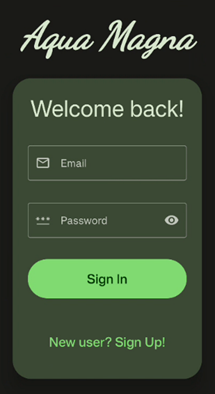
  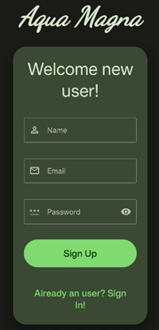
</p>

#### 2. Scan History
<p align="center">
  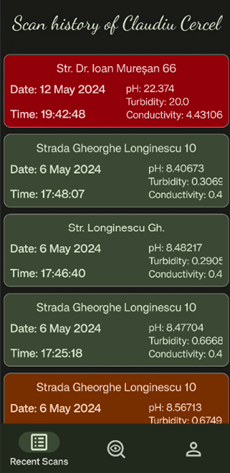
  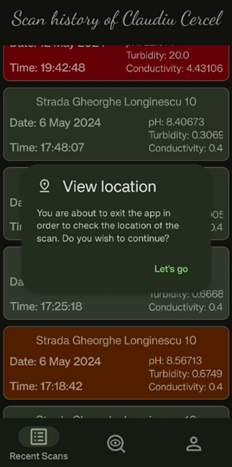
  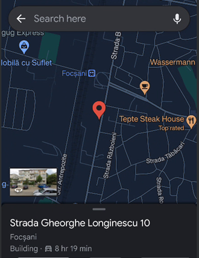
</p>

#### 3. New Scan
<p align="center">
  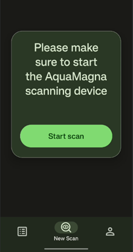
  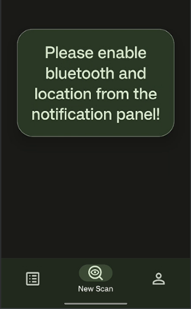
</p>
<p align="center">
  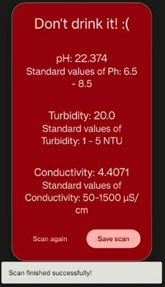
  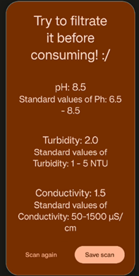
  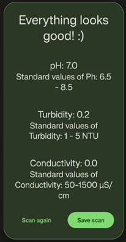
  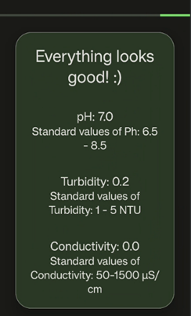
</p>

#### 4. User Profile
<p align="center">
  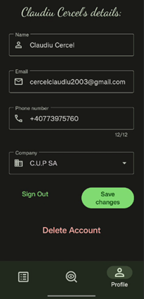
  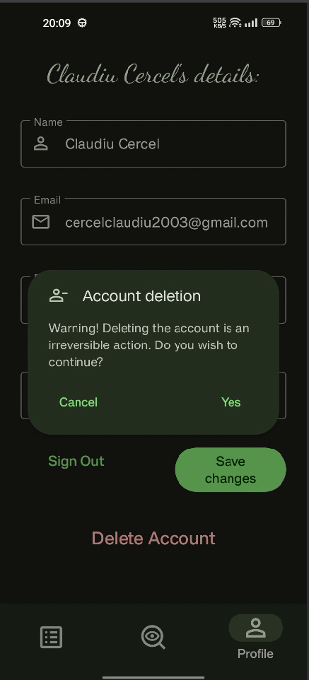
</p>

## Installation & Usage
### 1. Clone the Repository
```sh
git clone https://github.com/klaus-tm/AquaMagna.git
cd AquaMagna
```
### 2. Build the app
1. Launch Android Studio **Hedgehog**
2. Build Gradle and dependencies
3. Run the project to your local phone
4. [TODO] (provide apk releases)

### 4. Connect to Mobile App
1. Create an account for history visualization
2. Enable **Bluetooth** and **Location** on your phone.
3. Pair with the ESP32 device.
4. View and save sensor data in the app.

## Roadmap
- [x] Configure **ESP32 BLE connectivity**
- [x] Implement **Firebase data storage**
- [x] Develop **mobile app UI**
- [ ] Enhance **real-time graphing & analytics**
- [ ] Implement **push notifications for critical alerts**
- [ ] Bug fixing

## Known issues
1. New thread emerging when exiting the app and when rotating the phone. It breaks the scan phase
2. Enable location prompt not implemented

## Contributions
Contributions are welcome! Feel free to submit **issues**, **pull requests**, or discuss improvements.

## License
This project is licensed under the **MIT License**. See [LICENSE](LICENSE) for details.

## Acknowledgments
Special thanks to the open-source community for providing resources and libraries that make this project possible! The app uses Google's material design 3 principles
